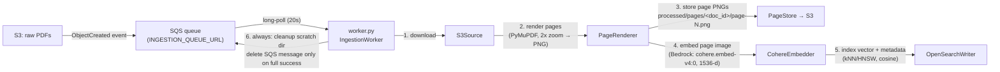

# ingestion-worker — SQS-driven document ingestion pipeline

Long-running worker that turns PDFs landing in S3 into searchable,
page-level multimodal embeddings in OpenSearch. Built for a retrieval
(RAG) stack where each PDF page is independently retrievable.

> **Status:** working implementation, single-commit history. There is no CI
> yet, and the surrounding AWS infrastructure (SQS queue, buckets,
> OpenSearch domain) is not codified — see *Roadmap*.

## Architecture



## Pipeline

An S3 ObjectCreated event (via EventBridge → SQS) triggers one job per
document:

1. **Download** — `S3Source` fetches the PDF to local scratch space
2. **Render** — `PageRenderer` rasterizes each page to PNG with PyMuPDF
   (2x zoom)
3. **Store** — `PageStore` writes page PNGs to the processed S3 bucket at
   `processed/pages/<document_id>/page-<NNNN>.png`
4. **Embed** — `CohereEmbedder` calls Cohere `embed-v4` on AWS Bedrock with
   the page image (`input_type=search_document`, 1536-dim float vector)
5. **Index** — `OpenSearchWriter` stores the vector plus metadata
   (`document_id`, `page_number`, source URIs, model id) in a kNN index
   (HNSW/faiss, cosine similarity), creating the index if needed
6. **Cleanup** — the job's scratch directory is always removed; the SQS
   message is deleted only after the whole document succeeds (failures stay
   visible for retry)

`document_id` is deterministic: `sha256("<bucket>:<key>:<etag>")`, so
re-uploads of the same object version map to the same id.

## Configuration (environment variables)

| Variable | Required | Default | Purpose |
|---|---|---|---|
| `INGESTION_QUEUE_URL` | yes | — | SQS queue to long-poll |
| `PROCESSED_BUCKET_NAME` | yes | — | S3 bucket for rendered pages |
| `OPENSEARCH_HOST` | yes | — | OpenSearch domain endpoint |
| `AWS_REGION` | no | `us-east-1` | Bedrock + OpenSearch region |
| `COHERE_EMBED_MODEL_ID` | no | `cohere.embed-v4:0` | Bedrock model id |
| `COHERE_EMBED_DIMENSION` | no | `1536` | Embedding / index dimension |
| `OPENSEARCH_INDEX_NAME` | no | `rag-pages-v1` | Target index |
| `OPENSEARCH_SERVICE` | no | `es` | `es` (OpenSearch Service) or `aoss` (Serverless) |

AWS credentials come from the standard chain (instance role / IRSA in
Kubernetes — see `k8s/`).

## Run locally

```bash
pip install -r requirements.txt
export INGESTION_QUEUE_URL=... PROCESSED_BUCKET_NAME=... OPENSEARCH_HOST=...
PYTHONPATH=src python -m worker
```

Or with Docker:

```bash
docker build -t ingestion-worker .
docker run --env-file .env ingestion-worker
```

## Tests

```bash
pip install pytest
PYTHONPATH=src pytest tests/ -q
```

Covers the pure, AWS-free logic (`create_document_id` determinism and
uniqueness). The AWS-touching stages have no tests yet — see *Roadmap*.

## Deployment (Kubernetes)

`k8s/helm/ingestion-worker/` is a Helm chart deploying the worker as a
Kubernetes `Deployment` (there is intentionally **no** `Service` — the
worker long-polls SQS and exposes no ports), plus a `ServiceAccount` for
IRSA. `k8s/argocd/application.yaml` is the Argo CD GitOps entrypoint.

```bash
helm lint --strict k8s/helm/ingestion-worker
helm template ingestion-worker k8s/helm/ingestion-worker --namespace ingestion
```

Manifests are validated with `helm lint` / `helm template` and
`kubectl --dry-run=client`; they have not been applied to a live cluster.
Set the required env values (queue URL, buckets, OpenSearch host) for your
environment — see `values.yaml`.

## Roadmap (not built yet)

- CI (pytest + `docker build`)
- Terraform for the SQS queue, buckets, and OpenSearch domain
- Tests for the AWS-touching stages (moto / mocks)
- Dead-letter queue + CloudWatch alarms for poison messages
- Batch embedding to reduce Bedrock calls per document

## Layout

```
ingestion_repo/
├── src/
│   ├── ingestion/
│   │   ├── s3_source.py       # S3 download
│   │   ├── page_renderer.py   # PDF → PNG (PyMuPDF)
│   │   ├── page_store.py      # page PNGs → processed bucket
│   │   ├── cohere_embedder.py # Cohere embed-v4 on Bedrock
│   │   └── opensearch_writer.py # kNN index writes
│   └── worker.py              # SQS poll loop orchestrating the pipeline
├── tests/
├── k8s/
│   ├── helm/ingestion-worker/ # Deployment + ServiceAccount chart
│   └── argocd/application.yaml
├── Dockerfile                 # python:3.12-slim, non-root user
└── requirements.txt           # boto3, opensearch-py, PyMuPDF
```

## License

MIT — see [LICENSE](LICENSE).
